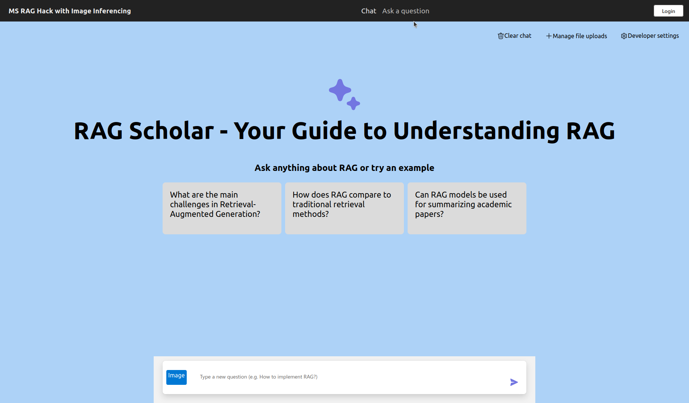
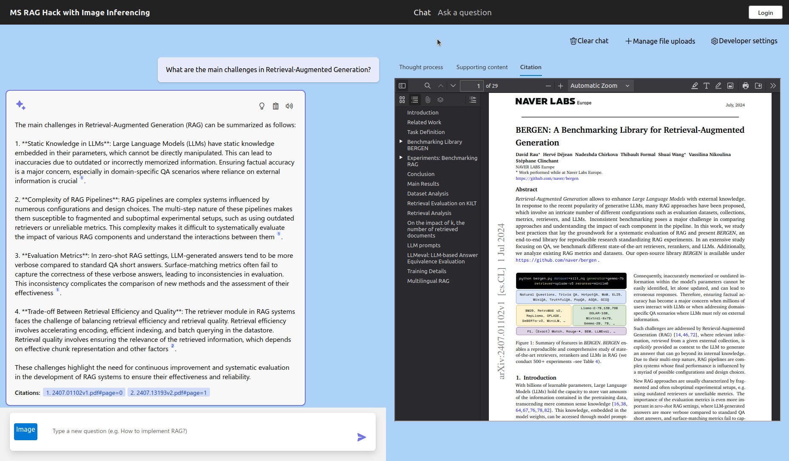
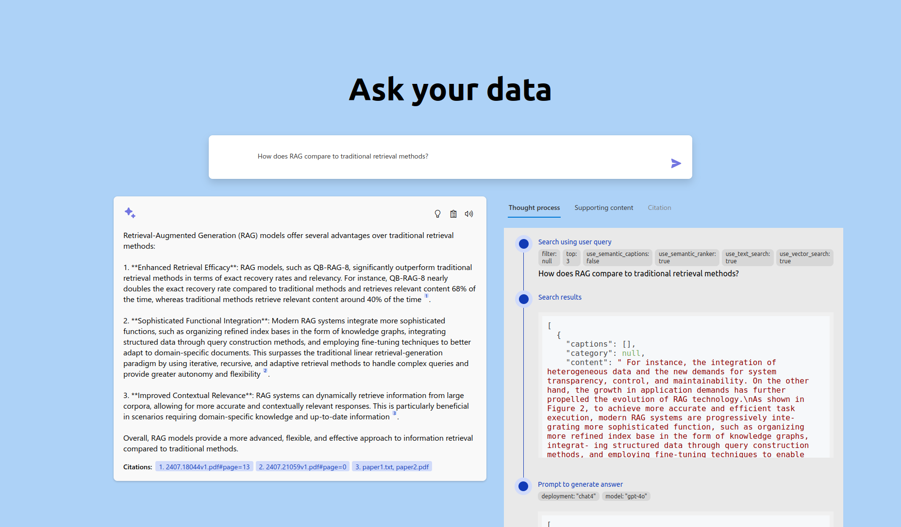

# **"RAG Scholar: Your Guide to Understanding Retrieval-Augmented Generation through Top Academic Papers"**

## App Overview:
RAG Scholar is an innovative application designed to empower users with a deep understanding of Retrieval-Augmented Generation (RAG) and its state-of-the-art advancements. This app serves as a comprehensive guide, offering insights into RAG’s various application domains, implementation techniques, existing challenges, and potential pathways to address these gaps. By exploring these areas, users can discover how to enhance productivity and apply RAG in novel fields. A unique feature of RAG Scholar is its ability to analyze user-uploaded images of RAG architectures, providing detailed, interactive explanations that make complex concepts accessible. This makes RAG Scholar an invaluable tool for researchers, practitioners, and anyone eager to explore the cutting edge of RAG technology.

##Data Sources: 
RAG Scholar leverages a carefully curated selection of the top 50 academic papers from the arXiv database that focus on Retrieval-Augmented Generation. These papers have been meticulously crawled and downloaded, forming the primary knowledge base of the application. The documents are securely stored in an Azure Storage Account, ensuring seamless access and efficient processing within the app, thereby providing users with a reliable and expansive resource to explore the latest RAG research.

## Modifications and Enhancements: 
Building upon the foundation of the Azure Chat OpenAI demo project, RAG Scholar includes substantial modifications to optimize the relevance and efficiency of inferencing. The prompts have been fine-tuned to yield more precise and contextually relevant responses, aligning closely with the nuanced needs of users delving into RAG topics. A significant enhancement is the integration of advanced image inferencing capabilities, enabling users to upload images of RAG architectures and receive comprehensive explanations. This feature not only enriches the user experience but also expands the app’s functionality, making complex RAG concepts more approachable and understandable.

## Target Audience: 
RAG Scholar is designed to cater to a wide-ranging audience, including students, researchers, educators, engineers, and anyone with an interest in learning about Retrieval-Augmented Generation. Its user-friendly interface and rich content make it accessible to both beginners and seasoned experts in the field. The app’s image inferencing feature is particularly beneficial for those who prefer visual learning or need to decode intricate RAG architectures, offering a practical tool for understanding and engaging with technical diagrams and models.

## Unique Features:
Among the standout features of RAG Scholar is its enhanced document parsing capability. Recognizing the limitations of Azure Document Intelligence in extracting complete information, RAG Scholar incorporates a custom local PDF parser that adeptly extracts text, tables, and images from PDFs. These elements are then processed by the GPT-4O model to generate clear and concise textual summaries. This approach not only reduces data ingestion costs but also organizes unstructured data into a coherent and systematic format. By streamlining complex academic content into accessible insights, RAG Scholar ensures a smooth and enriching learning experience for its users.

The deployed applications can be viewed on [RAG Scholar Deployment](https://app-backend-ee7ehcxf6urek.azurewebsites.net/).

## Screenshots:

The code is based on [azure-search-openai-demo](https://github.com/Azure-Samples/azure-search-openai-demo). 
